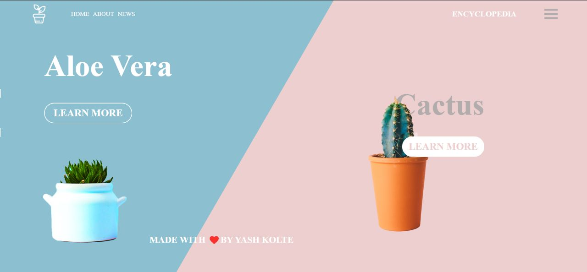

# UI Design  
  
 This design is created for showing interest in UI design. It is not a real project. 
 But it is a good example of how to use the design system. 
 and it can be improved for real project. 
  
Only Responsive for Desktop
  
  
  
 ## 🔗 Links 
  
  
  
  
  
 ## Support 
  
 If you like this project, please consider supporting it by giving a ⭐️.
  
 ## Inspiration  
  
 Design is inspired from behance 
  
 Thanks to Alzea Arafat
